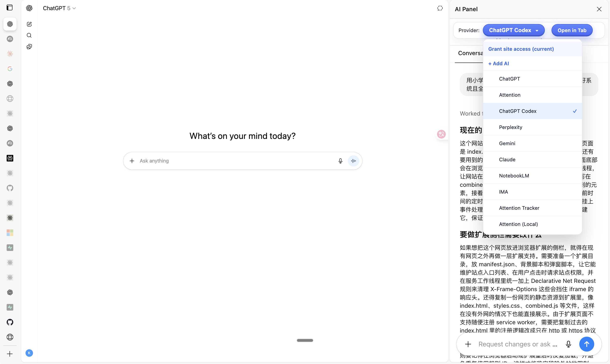

# AI Sidebar Chrome Extension 🤖

  

## Overview

This Chrome extension integrates popular AI chat providers directly into your browser's side panel. It supports ChatGPT, Perplexity, Gemini, Claude, NotebookLM, and more, allowing you to access them without switching tabs.

## Preview

  

## Features

- **🎯 Side Panel Integration:** Access ChatGPT, Perplexity, Gemini, Claude, NotebookLM, IMA, and Attention Tracker from the side panel.
- **🔄 Provider Switcher:** Quick dropdown to switch between AI providers; your choice is automatically remembered.
- **✅ Session Awareness:** Checks login status and prompts if needed (especially for ChatGPT).
- **🔧 Header Adjustments:** Removes `content-security-policy`/`x-frame-options` headers for supported domains to allow seamless embedding.
- **📱 Responsive Design:** Works smoothly with all supported AI platforms.

## Supported AI Providers

- **ChatGPT** - OpenAI's conversational AI
- **ChatGPT Codex** - Code-focused ChatGPT variant
- **Perplexity** - AI-powered search engine
- **Gemini** - Google's AI assistant
- **Claude** - Anthropic's AI assistant
- **NotebookLM** - Google's AI note-taking tool
- **Google** - Google Search (AI Overview / UDM)
- **IMA** - Integrated AI assistant
- **Attention Tracker** - Focus and productivity tracking

## Installation

1. Clone or download the project files.
2. Open Chrome and navigate to `chrome://extensions/`.
3. Enable **Developer mode**.
4. Click **Load unpacked** and select the directory containing the extension files.
5. The extension will now appear in the Chrome extensions list and can be accessed from the toolbar.

## Permissions

- **sidePanel:** Adds content to the side panel.
- **declarativeNetRequest & declarativeNetRequestWithHostAccess:** Modifies headers to allow embedding.
- **storage:** Saves your selected provider.

## How It Works

1. Open the side panel and choose a provider from the dropdown.
2. For ChatGPT, the extension checks session status and shows a login prompt if necessary; for Perplexity and Gemini, it loads the site directly in the panel.
3. The extension modifies specific request headers to prevent `content-security-policy` and `x-frame-options` from blocking the embedded pages.

## Troubleshooting

- **Login screens inside the panel:** Some providers (especially Gemini/Google) may redirect to login pages like `accounts.google.com`. Header rules are added, but some flows can still refuse to render in iframes due to provider-side restrictions; in such cases, use "Open in Tab" to sign in, then return to the panel.
- **ChatGPT 403/Cloudflare:** Open ChatGPT in a regular tab to pass checks, then the panel will load.
- **Error fetching session:** Network hiccup; refresh the panel or reload the extension.

 

## License

This project is licensed under the MIT License.
